# CardDemo Mainframe Architecture

## System Overview

CardDemo is a legacy mainframe credit card management system demonstrating typical enterprise COBOL/CICS patterns.

## Architecture Diagram

```mermaid
graph TB
    subgraph "User Interface Layer"
        USER[👤 End Users<br/>3270 Terminal]
        ADMIN[👤 Administrators<br/>3270 Terminal]
    end

    subgraph "Online Transaction Processing - CICS"
        SIGNON[CC00<br/>Signon]
        MAINMENU[CM00<br/>Main Menu]
        ADMINMENU[CA00<br/>Admin Menu]

        subgraph "Account Operations"
            ACCTVIEW[CAVW<br/>View Account]
            ACCTUPD[CAUP<br/>Update Account]
        end

        subgraph "Card Operations"
            CARDLIST[CCLI<br/>List Cards]
            CARDDEL[CCDL<br/>Delete Card]
            CARDUPD[CCUP<br/>Update Card]
        end

        subgraph "Transaction Operations"
            TRANVIEW[CT00/CT01/CT02<br/>View/Add Transactions]
            TRANRPT[CR00<br/>Transaction Reports]
            BILLPAY[CB00<br/>Bill Payment]
        end

        subgraph "User Administration"
            USERLIST[CU00<br/>List Users]
            USERADD[CU01<br/>Add User]
            USERUPD[CU02<br/>Update User]
            USERDEL[CU03<br/>Delete User]
        end

        subgraph "Optional Modules"
            TRANTYPE[CTTU/CTLI<br/>Transaction Types<br/>DB2]
            PENDAUTH[CPVS/CPVD<br/>Pending Auth<br/>IMS]
            MQOPS[CDRD/CDRA<br/>MQ Operations]
        end
    end

    subgraph "Business Logic Layer"
        subgraph "COBOL Programs"
            ACCTPGM[Account Programs<br/>COACTUPC, COACTVWC]
            CARDPGM[Card Programs<br/>COCRDUPC, COCRDLIC]
            TRANPGM[Transaction Programs<br/>COTRN00C, COTRN01C]
            USERPGM[User Programs<br/>COUSR00C - COUSR03C]
            SECPGM[Security Programs<br/>CSUSR01C]
            UTILPGM[Utility Programs<br/>Date/Time/Logging]
        end

        subgraph "BMS Maps"
            SCREENS[Screen Maps<br/>Input/Output Layouts]
        end
    end

    subgraph "Data Layer"
        subgraph "VSAM Files - Primary Storage"
            USRSEC[(USRSEC<br/>User Security)]
            ACCTDATA[(ACCTDATA<br/>Account Data)]
            CARDDATA[(CARDDATA<br/>Card Data)]
            CUSTDATA[(CUSTDATA<br/>Customer Data)]
            CARDXREF[(CARDXREF<br/>Card Cross-Ref)]
            TRANSACT[(TRANSACT<br/>Transactions)]
            TCATBALF[(TCATBALF<br/>Category Balances)]
        end

        subgraph "VSAM Files - Reference Data"
            DISCGRP[(DISCGRP<br/>Disclosure Groups)]
            TRANTYPE_V[(TRANTYPE<br/>Transaction Types)]
            TRANCATG[(TRANCATG<br/>Categories)]
        end

        subgraph "Optional Data Stores"
            DB2[(DB2<br/>Relational DB<br/>Transaction Types)]
            IMS[(IMS DB<br/>Hierarchical DB<br/>Authorizations)]
        end
    end

    subgraph "Batch Processing Layer"
        subgraph "Core Batch Jobs - JCL"
            POSTTRAN[POSTTRAN<br/>Post Transactions<br/>CBTRN02C]
            INTCALC[INTCALC<br/>Calculate Interest<br/>CBACT04C]
            CREASTMT[CREASTMT<br/>Create Statements]
            COMBTRA[COMBTRA<br/>Combine Trans Files]
        end

        subgraph "File Management Jobs"
            DATALOAD[Data Loading<br/>ACCTFILE, CARDFILE<br/>CUSTFILE]
            FILEOPEN[File Open/Close<br/>OPENFIL, CLOSEFIL]
            INDEXMGMT[Index Management<br/>TRANIDX]
        end

        subgraph "Optional Batch Jobs"
            DB2BATCH[DB2 Jobs<br/>CREDB21, TRANEXTR]
            AUTHPURGE[Auth Purge<br/>CBPAUP0J]
        end
    end

    subgraph "Integration Layer"
        MQ[IBM MQ<br/>Message Queuing<br/>Async Processing]
        ASSEMBLER[Assembler Programs<br/>MVSAAIT, COBDATFT<br/>Low-level Utilities]
    end

    subgraph "Security & Infrastructure"
        RACF[RACF<br/>Security Framework<br/>Authentication/Authorization]
        GDG[GDG<br/>Generation Data Groups<br/>Historical Data]
    end

    %% User flows
    USER --> SIGNON
    ADMIN --> SIGNON
    SIGNON --> MAINMENU
    SIGNON --> ADMINMENU

    %% Main menu flows
    MAINMENU --> ACCTVIEW
    MAINMENU --> ACCTUPD
    MAINMENU --> CARDLIST
    MAINMENU --> CARDDEL
    MAINMENU --> CARDUPD
    MAINMENU --> TRANVIEW
    MAINMENU --> TRANRPT
    MAINMENU --> BILLPAY

    %% Admin flows
    ADMINMENU --> USERLIST
    ADMINMENU --> USERADD
    ADMINMENU --> USERUPD
    ADMINMENU --> USERDEL
    ADMINMENU --> TRANTYPE

    %% Optional module connections
    MAINMENU -.-> PENDAUTH
    MAINMENU -.-> MQOPS

    %% CICS to COBOL
    ACCTVIEW --> ACCTPGM
    ACCTUPD --> ACCTPGM
    CARDLIST --> CARDPGM
    CARDDEL --> CARDPGM
    CARDUPD --> CARDPGM
    TRANVIEW --> TRANPGM
    TRANRPT --> TRANPGM
    BILLPAY --> TRANPGM
    USERLIST --> USERPGM
    USERADD --> USERPGM
    USERUPD --> USERPGM
    USERDEL --> USERPGM
    SIGNON --> SECPGM

    %% COBOL to BMS
    ACCTPGM --> SCREENS
    CARDPGM --> SCREENS
    TRANPGM --> SCREENS
    USERPGM --> SCREENS
    SECPGM --> SCREENS

    %% COBOL to VSAM
    SECPGM --> USRSEC
    ACCTPGM --> ACCTDATA
    CARDPGM --> CARDDATA
    CARDPGM --> CARDXREF
    ACCTPGM --> CUSTDATA
    TRANPGM --> TRANSACT
    TRANPGM --> TCATBALF
    ACCTPGM --> DISCGRP
    TRANPGM --> TRANTYPE_V
    TRANPGM --> TRANCATG

    %% Optional data store connections
    TRANTYPE -.-> DB2
    PENDAUTH -.-> IMS

    %% Batch to VSAM
    DATALOAD --> ACCTDATA
    DATALOAD --> CARDDATA
    DATALOAD --> CUSTDATA
    POSTTRAN --> TRANSACT
    POSTTRAN --> TCATBALF
    INTCALC --> ACCTDATA
    CREASTMT --> TRANSACT
    COMBTRA --> TRANSACT
    INDEXMGMT --> TRANSACT

    %% Batch to optional stores
    DB2BATCH -.-> DB2
    AUTHPURGE -.-> IMS

    %% MQ connections
    MQOPS --> MQ
    MQ -.-> POSTTRAN

    %% Utility connections
    ACCTPGM --> UTILPGM
    CARDPGM --> UTILPGM
    TRANPGM --> UTILPGM
    USERPGM --> UTILPGM
    UTILPGM --> ASSEMBLER

    %% Security
    SIGNON --> RACF
    RACF --> USRSEC

    %% GDG for historical data
    CREASTMT --> GDG

    %% File coordination
    FILEOPEN -.->|Open/Close| ACCTDATA
    FILEOPEN -.->|Open/Close| CARDDATA
    FILEOPEN -.->|Open/Close| TRANSACT

    classDef userClass fill:#e1f5ff,stroke:#01579b,stroke-width:2px
    classDef cicsClass fill:#fff9c4,stroke:#f57f17,stroke-width:2px
    classDef cobolClass fill:#f3e5f5,stroke:#4a148c,stroke-width:2px
    classDef vsamClass fill:#e8f5e9,stroke:#1b5e20,stroke-width:2px
    classDef batchClass fill:#ffe0b2,stroke:#e65100,stroke-width:2px
    classDef optionalClass fill:#f5f5f5,stroke:#757575,stroke-width:2px,stroke-dasharray: 5 5

    class USER,ADMIN userClass
    class SIGNON,MAINMENU,ADMINMENU,ACCTVIEW,ACCTUPD,CARDLIST,CARDDEL,CARDUPD,TRANVIEW,TRANRPT,BILLPAY,USERLIST,USERADD,USERUPD,USERDEL cicsClass
    class ACCTPGM,CARDPGM,TRANPGM,USERPGM,SECPGM,UTILPGM,SCREENS cobolClass
    class USRSEC,ACCTDATA,CARDDATA,CUSTDATA,CARDXREF,TRANSACT,TCATBALF,DISCGRP,TRANTYPE_V,TRANCATG vsamClass
    class POSTTRAN,INTCALC,CREASTMT,COMBTRA,DATALOAD,FILEOPEN,INDEXMGMT batchClass
    class TRANTYPE,PENDAUTH,MQOPS,DB2,IMS,DB2BATCH,AUTHPURGE optionalClass
```



## Component Descriptions

### 1. User Interface Layer
- **3270 Terminal Emulation**: Green-screen character-based interface
- **Users**: End users managing accounts, cards, and transactions
- **Administrators**: System admins managing users and configuration

### 2. Online Transaction Processing (CICS)
- **23 CICS Transactions**: Handle all online user interactions
- **Transaction Codes**: Each function has a 4-character code (e.g., CC00, CM00)
- **BMS Maps**: Define screen layouts and data input/output

### 3. Business Logic Layer
- **COBOL Programs**: ~40+ programs implementing business rules
- **Program Types**:
  - **Online Programs**: Handle CICS transactions (prefix: CO*)
  - **Batch Programs**: Process data in bulk (prefix: CB*)
  - **Utility Programs**: Common functions (date, time, logging)

### 4. Data Layer
- **Primary Storage**: VSAM KSDS (Key-Sequenced Data Sets)
- **10 Main Files**: User security, accounts, cards, customers, transactions, etc.
- **Optional Storage**: DB2 (relational), IMS DB (hierarchical)

### 5. Batch Processing Layer
- **30+ JCL Jobs**: Scheduled batch operations
- **Core Functions**:
  - Daily transaction posting
  - Interest calculation
  - Statement generation
  - File maintenance
  - Report generation

### 6. Integration Layer
- **IBM MQ**: Asynchronous message processing
- **Assembler Programs**: System-level utilities
- **File Coordination**: Open/close operations for CICS/batch sync

### 7. Security
- **RACF**: Mainframe security framework
- **User Security File**: VSAM file storing credentials
- **Transaction-level Authorization**: Different access for users vs. admins

## Data Flow Patterns

### Online Transaction Flow
```
User Input → CICS Transaction → COBOL Program → VSAM File → COBOL Program → BMS Map → Screen Output
```

### Batch Processing Flow
```
Scheduled Job → JCL → COBOL Batch Program → Read VSAM → Process Data → Write VSAM → Generate Reports
```

### Async Processing Flow
```
Online Transaction → MQ Message → Queue → Batch Job → Process → Update Files → Response Queue
```

## Key Architectural Patterns

1. **Transaction Processing**: CICS provides ACID guarantees for online operations
2. **File-Based Storage**: VSAM indexed files instead of relational databases
3. **Batch-Online Coordination**: Jobs close files before batch, reopen after
4. **Pseudo-Conversational**: Transactions don't hold resources between user interactions
5. **Copybook Reuse**: Data structures shared between online and batch programs
6. **GDG Versioning**: Generation Data Groups for historical data retention

## Performance Characteristics

- **Online**: Sub-second response time for CICS transactions
- **Batch**: Process millions of records in nightly jobs
- **Concurrency**: Hundreds of concurrent CICS users
- **Data Volume**: Enterprise-scale card portfolio

## Modernization Challenges

This architecture presents typical mainframe modernization challenges:

1. **Monolithic Structure**: Tight coupling between presentation, logic, and data
2. **Proprietary Technologies**: CICS, VSAM, JCL, BMS specific to mainframe
3. **Character-Based UI**: 3270 terminals vs. modern web/mobile
4. **Batch Dependencies**: Daily cycles vs. real-time processing
5. **File-Based Storage**: VSAM vs. relational/NoSQL databases
6. **COBOL Business Logic**: Need to extract and translate business rules

---

**Next Step**: Create a modern Next.js architecture that addresses these limitations while preserving the core business functionality.
