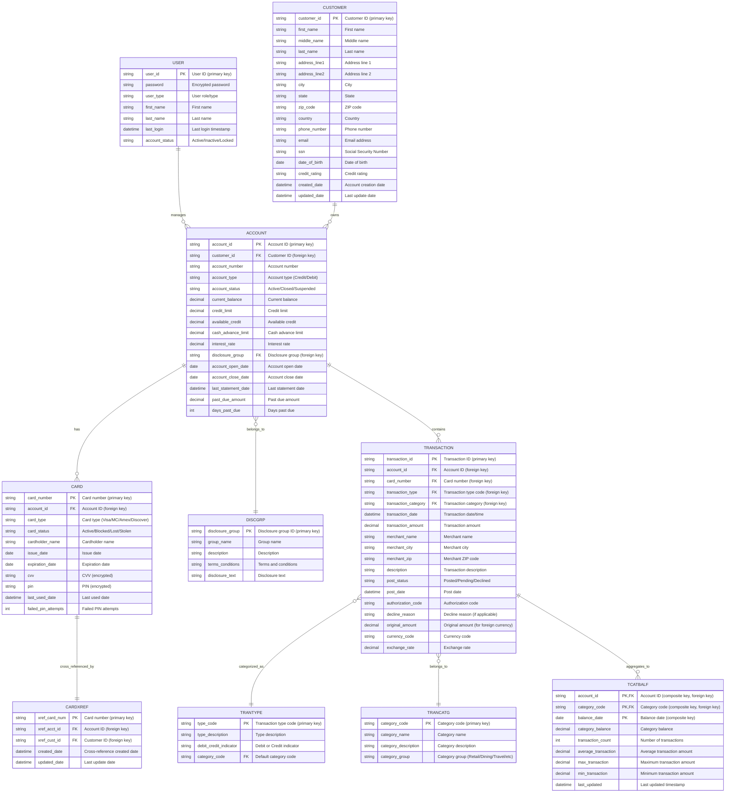

# CardDemo Entity-Relationship Diagram (ERD)

## Overview
This ERD represents the data model for the CardDemo mainframe credit card processing system, which uses VSAM files as the primary data storage mechanism.

---

## Entity-Relationship Diagram

---

## Detailed Relationships

### 1. USER ↔ ACCOUNT
- **Relationship Type:** One-to-Many
- **Description:** A user (employee/administrator) can manage multiple accounts
- **Cardinality:** 1:N
- **Implementation:** User authentication via USRSEC file, managed through RACF security

### 2. CUSTOMER ↔ ACCOUNT
- **Relationship Type:** One-to-Many
- **Description:** A customer can own multiple accounts (e.g., multiple credit cards)
- **Cardinality:** 1:N
- **Foreign Key:** `ACCOUNT.customer_id` references `CUSTOMER.customer_id`

### 3. ACCOUNT ↔ CARD
- **Relationship Type:** One-to-Many
- **Description:** An account can have multiple cards (primary, secondary, replacement)
- **Cardinality:** 1:N
- **Foreign Key:** `CARD.account_id` references `ACCOUNT.account_id`

### 4. CARD ↔ CARDXREF
- **Relationship Type:** One-to-One
- **Description:** Each card has a cross-reference entry for quick lookup
- **Cardinality:** 1:1
- **Purpose:** Index/lookup table for efficient card-to-account mapping

### 5. ACCOUNT ↔ DISCGRP
- **Relationship Type:** Many-to-One
- **Description:** Multiple accounts belong to one disclosure group (terms & conditions)
- **Cardinality:** N:1
- **Foreign Key:** `ACCOUNT.disclosure_group` references `DISCGRP.disclosure_group`

### 6. ACCOUNT ↔ TRANSACTION
- **Relationship Type:** One-to-Many
- **Description:** An account contains multiple transactions
- **Cardinality:** 1:N
- **Foreign Key:** `TRANSACTION.account_id` references `ACCOUNT.account_id`
- **Volume:** High volume - grows daily with new transactions

### 7. TRANSACTION ↔ TRANTYPE
- **Relationship Type:** Many-to-One
- **Description:** Multiple transactions share the same transaction type
- **Cardinality:** N:1
- **Foreign Key:** `TRANSACTION.transaction_type` references `TRANTYPE.type_code`
- **Examples:** Purchase, Cash Advance, Payment, Fee, Interest

### 8. TRANSACTION ↔ TRANCATG
- **Relationship Type:** Many-to-One
- **Description:** Multiple transactions belong to the same category
- **Cardinality:** N:1
- **Foreign Key:** `TRANSACTION.transaction_category` references `TRANCATG.category_code`
- **Examples:** Retail, Dining, Travel, Gas, Groceries

### 9. TRANSACTION ↔ TCATBALF
- **Relationship Type:** Many-to-Many (aggregated)
- **Description:** Transactions are aggregated into category balances by account and category
- **Cardinality:** N:N (aggregated)
- **Purpose:** Summary/reporting data for analytics and statements
- **Update Pattern:** Batch processing (daily or real-time aggregation)

---

## Data Storage Implementation

### VSAM Files (Primary Storage)
| Entity | VSAM File | Key Field | Access Method |
|--------|-----------|-----------|---------------|
| USER | USRSEC | user_id | KSDS (Key-Sequenced) |
| CUSTOMER | CUSTDATA | customer_id | KSDS |
| ACCOUNT | ACCTDATA | account_id | KSDS |
| CARD | CARDDATA | card_number | KSDS |
| CARDXREF | CARDXREF | xref_card_num | KSDS |
| TRANSACTION | TRANSACT | transaction_id | KSDS |
| DISCGRP | DISCGRP | disclosure_group | KSDS |
| TRANTYPE | TRANTYPE | type_code | KSDS |
| TRANCATG | TRANCATG | category_code | KSDS |
| TCATBALF | TCATBALF | account_id + category_code + date | KSDS |

### Optional Alternative Storage
- **DB2**: TRANTYPE table (optional relational storage)
- **IMS DB**: Pending authorizations (hierarchical database)

---

## Data Access Patterns

### Online (CICS) Transactions
- **Random Access:** Direct key-based lookup via VSAM KSDS
- **Response Time:** Sub-second (< 1 second)
- **Concurrency:** High - thousands of concurrent users
- **Programs:** COACTUPC, COCRDUPC, COTRN00C, etc.

### Batch Processing
- **Sequential Access:** Full file scans for reporting and updates
- **Volume:** Millions of records processed nightly
- **Programs:** CBTRN02C, CBACT04C, POSTTRAN, INTCALC, CREASTMT

---

## Normalization Level

The data model demonstrates **3rd Normal Form (3NF)** characteristics:

1. **1NF:** All attributes contain atomic values (no repeating groups)
2. **2NF:** No partial dependencies (all non-key attributes depend on the entire primary key)
3. **3NF:** No transitive dependencies (non-key attributes depend only on the primary key)

### Denormalization Considerations
- **TCATBALF:** Intentionally denormalized aggregate table for performance
- **CARDXREF:** Redundant index table for fast lookups
- Trade-off: Storage space vs. query performance (appropriate for mainframe batch processing)

---

## Referential Integrity

### Primary Keys
All entities have clearly defined primary keys (mostly single-column, except TCATBALF which has a composite key).

### Foreign Keys
While VSAM does not enforce referential integrity at the file level, the application logic enforces these relationships:
- Customer → Account
- Account → Card
- Account → Transaction
- Account → Disclosure Group
- Transaction → Transaction Type
- Transaction → Transaction Category
- Card → Card Cross-Reference

### Orphan Prevention
COBOL programs implement business logic to prevent orphaned records during:
- Account deletion (must cascade to cards and transactions)
- Card deletion (must update cross-reference)
- Customer deletion (must handle existing accounts)

---

## Indexes and Performance

### Primary Indexes (VSAM KSDS)
- All files use key-sequenced data sets (KSDS) with primary keys
- Direct access via key provides O(log n) performance

### Secondary Indexes
- **CARDXREF:** Secondary index for card-to-account lookups
- Potential for additional alternate indexes (AIX) on:
  - Account by customer_id
  - Transaction by account_id + date
  - Customer by last_name

### Performance Optimization
- **Batch Processing:** Sequential read optimization for large data volumes
- **Buffer Pools:** CICS buffer pools for frequently accessed data
- **Shared Resources:** VSAM RLS (Record Level Sharing) for concurrent access

---

## Data Retention and Archival

### Transactional Data
- **TRANSACT:** High volume, grows indefinitely
- **Archival Strategy:** GDG (Generation Data Groups) for historical statements
- **CREASTMT Job:** Generates monthly statements and archives to GDG

### Audit Trail
- Transaction records provide full audit trail
- TCATBALF provides summarized historical data
- User activity logged via USRSEC

---

## Modernization Opportunities

### Migration to Relational Database
This VSAM-based model can be directly mapped to a relational database (PostgreSQL, MySQL, Oracle):

1. **VSAM → Tables:** Each VSAM file becomes a table
2. **Keys → Primary Keys:** Direct mapping
3. **Referential Integrity:** Add foreign key constraints
4. **Indexes:** Create indexes on foreign keys and frequently queried columns
5. **Transactions:** Use ACID transactions instead of VSAM record locking

### API Layer
- RESTful APIs for CRUD operations on each entity
- GraphQL for complex queries spanning multiple entities
- Event-driven architecture for real-time transaction processing

### Cloud Migration
- **Storage:** Cloud-native databases (AWS RDS, Azure SQL, Google Cloud SQL)
- **Processing:** Containerized microservices (Kubernetes)
- **Integration:** Message queues (Kafka, RabbitMQ) instead of MQ Series

---

## Summary

The CardDemo ERD represents a **well-structured, normalized data model** typical of enterprise mainframe systems:

- **10 core entities** with clear relationships
- **VSAM-based storage** with KSDS files
- **Strong transactional integrity** enforced by application logic
- **High-volume transaction processing** capability
- **Aggregate data (TCATBALF)** for reporting and analytics
- **Reference data (TRANTYPE, TRANCATG, DISCGRP)** for lookups

This architecture is **production-ready for mainframe environments** but also **ripe for modernization** to cloud-native, relational database systems with enhanced scalability, flexibility, and developer-friendly APIs.

---

## Files Referenced
- **VSAM Files:** USRSEC, CUSTDATA, ACCTDATA, CARDDATA, CARDXREF, TRANSACT, TCATBALF, DISCGRP, TRANTYPE, TRANCATG
- **COBOL Programs:** COACTUPC, COACTVWC, COCRDUPC, COCRDLIC, COTRN00C, COTRN01C, COUSR00C-COUSR03C, CSUSR01C
- **Batch Jobs:** CBTRN02C, CBACT04C, POSTTRAN, INTCALC, CREASTMT, COMBTRA, TRANIDX
- **Architecture Documentation:** CARDDEMO_ARCHITECTURE.md

---

**Generated:** 2025-11-17
**System:** CardDemo Mainframe Credit Card Processing System
**Technology:** COBOL, CICS, VSAM, JCL, MQ Series
